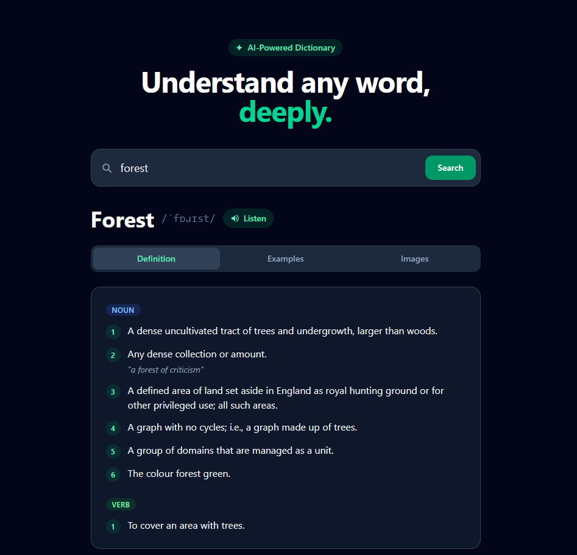

# WordWise — Online Dictionary

A modern vocabulary learning tool built with React + Vite + TailwindCSS. Search any word and instantly get definitions, pronunciation, example sentences, and real photos — all in one clean interface.

## 🔗 Live Demo

[View Live Application](https://ai-dictionary-portfolioproject.vercel.app/)



## Features

- **Definitions** — grouped by part of speech (noun, verb, adjective…) with numbered meanings
- **Audio Pronunciation** — US English playback via the Free Dictionary API
- **Example Sentences** — real examples from the dictionary, with smart fallback generation when none exist
- **Synonyms** — listed alongside examples
- **Photo Search** — 4 real photos per word powered by the Pexels API
- **Light / Dark mode** — toggle with a single click, respects system preference on first load

## Tech Stack

| Layer           | Technology                                                          |
| --------------- | ------------------------------------------------------------------- |
| Framework       | React 19 + Vite 8                                                   |
| Styling         | TailwindCSS                                                         |
| Dictionary data | [Free Dictionary API](https://dictionaryapi.dev/) — no key required |
| Photos          | [Pexels API](https://www.pexels.com/api/) — free key required       |

## Skills Demonstrated

- React Hooks (useState, useEffect)
- API integration and asynchronous data fetching
- Environment variables management
- Responsive UI development
- Component-based architecture
- Error handling and loading states
- Dark mode implementation

## Getting Started

### 1. Clone the repo

```bash
git clone https://github.com/study-path/ai-dictionary.git
cd ai-dictionary
```

### 2. Install dependencies

```bash
npm install
```

### 3. Add your Pexels API key

Create a `.env` file in the project root:

```
VITE_PEXELS_API_KEY=your_pexels_key_here
```

Get a free key at [pexels.com/api](https://www.pexels.com/api/) — instant, no credit card needed.

### 4. Run the dev server

```bash
npm run dev
```

Open [http://localhost:5173](http://localhost:5173) in your browser.
